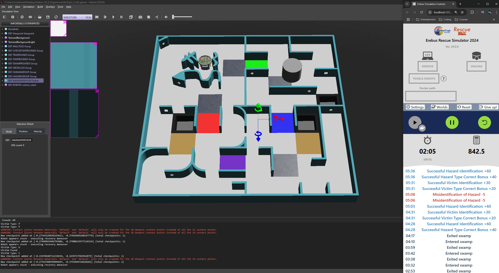
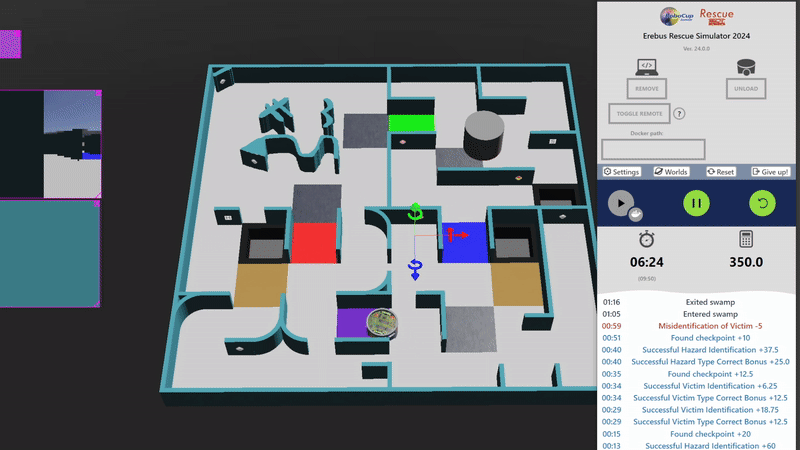

# 🤖 RCJE-Team-ResQ  

This repository contains a **modular, competition-ready robot controller** for the **RoboCup Junior Rescue Simulation** challenge, designed for **Webots** and **Erebus**.  

Written in **Python**, it implements advanced rescue behaviors like **victim detection, hazard avoidance, checkpoint navigation, and stuck recovery**. Our team achieved a **Top 5** finish in the *RoboCup Junior Egypt Rescue Simulation Maze*!  

---
## 📚 Table of Contents
- [Overview](#-overview)
- [Sample Score Display](#-sample-score-display)
- [Features](#-features)
- [Quick Setup](#-quick-setup)
- [Tech Stack](#-tech-stack)
- [Architecture](#-architecture)
- [How It Works](#-how-it-works)
- [Team Members](#-team-members)
- [Personal Achievement](#-personal-achievement)
- [Contributions](#-contributions)
- [Contact & Questions](#-contact--questions)

---

## 🌐 Overview  
The controller integrates with **Webots** via the **Erebus** framework, enabling realistic testing of rescue scenarios. Its modular design ensures easy expansion and debugging.  

---
## 📊 Sample Score Display



## 🎥 Robot Demo




## 🚀 Features  

### **Navigation & Mapping**  
- **Obstacle Avoidance**: Uses LIDAR for dynamic wall detection and path correction.  
- **Checkpoint System**: Tracks the start zone for scoring and re-entry logic, Floating wall tracking.  
- **Stuck Recovery**: Executes 180° turns when trapped.

### **Hazard Detection**  
- **Black Tiles & Swamps**: Identified via color sensors.  
- **Chemical Hazards**: Detects flammable gas, poison, corrosive, and organic peroxide.  

### **Victim Detection**  
- **OpenCV Processing**: Analyzes camera feed to identify `H`, `S`, and `U` victims.  
- **RGB Filtering**: Isolates victim markers under varying lighting.  

### **Movement Logic**  
- **Wall-Following**: Default navigation mode in tight spaces.  
- **Floating Wall Detection**: Adjusts path dynamically using checkpoints.  

---

## 🛠️ Quick Setup  
### **Prerequisites**  
- **[Webots R2023b](https://cyberbotics.com/)** (`2023b`)  
- **[Erebus](https://erebus.rcj.cloud/) Framework** (`V24.0.0`)  
- **Python** (`3.10`)

### **Steps**  
1. Clone this repository:  
   ```bash  
   git clone https://github.com/your-username/RCJE-Team-ResQ.git  
   cd RCJE-Team-ResQ
   ```
2. Install dependencies:
   ```
   pip install opencv-python numpy
   ```
3. Open the project in Webots 2023b and run the simulation.

## 🧰 Tech Stack

| Component   | Version   | Notes                      |
|-------------|-----------|----------------------------|
| Webots      | 2023b     | Robot simulation platform  |
| Erebus      | V24.0.0   | RCJ Webots framework       |
| Python      | 3.10      | Primary language           |
| OpenCV      | 4.x       | Computer vision            |
| NumPy       | 1.23+     | Numerical operations       |


## 🧠 Architecture
controller.py  
├── Robot Initialization  
│   ├── Device setup (motors, sensors, lidar, camera)  
│   └── Movement constraints (speed, turning radius)  
├── Mapping & Navigation  
│   ├── GPS + Compass position tracking  
│   └── Dynamic heading adjustment  
├── Detection Systems  
│   ├── Color sensor for hazards  
│   └── OpenCV for victim detection  
├── Movement Logic  
│   ├── Wall-following mode  
│   └── Recovery turns  
└── Main Loop  
    ├── Tick-based updates  
    └── State persistence (victims, hazards)  
## 🔍 How It Works

### 🧭 Core Navigation Strategy
- **Left-Wall Following Algorithm**:  
  - Uses LIDAR to maintain optimal distance from left wall  

### 👁️ Detection Systems
- **Victim Detection**:  
  - Processes camera feed using OpenCV  
  - Identifies H/S/U markers through HSV color filtering  
  - Logs GPS coordinates when victims are found  

- **Hazard Detection**:  
  - **Camera-Based Identification**:  
    - Detects all hazard types (black tiles, swamps, chemical symbols)  
    - Uses template matching for chemical hazard recognition   

### 🔄 Floating Wall Recovery
- **Checkpoint System**:  
  - Creates virtual checkpoints every 10s  
  - Tracks checkpoint passes using GPS coordinates  
- **Recovery Protocol**:  
  - Triggers when same checkpoint is hit 3 times in 10s  
  - Executes move_backwards() and turns to the right.  

## 👥 Team Members

**Mohannad Abdallah**  
*Team Lead & Sole Developer*  
- Designed and implemented all system architecture  
- Developed core navigation algorithms  
- Integrated all sensor systems (LIDAR, Camera, GPS)  
- Created the victim/hazard detection pipeline  
- Optimized performance for competition

## 🏆 Personal Achievement
This project was independently developed and achieved **Top 5** placement in the RoboCup Junior Egypt Rescue Simulation Maze, demonstrating:
- Complete system design and implementation capability  
- Mastery of robotic control systems  
- Advanced problem-solving in dynamic environments

## 🤝 Contributions
We welcome all contributions - from bug reports to feature implementations!

### 🐛 Reporting Bugs
- Open a [new issue](https://github.com/your-username/RCJE-Team-ResQ/issues) with:
  - Clear title (e.g., "LIDAR fails at corridor intersections")
  - Webots version and Python environment details
  - Complete reproduction steps
  - Expected vs actual behavior
  - Relevant screenshots/simulation logs
  - Error messages (if any)

### 💡 Feature Requests
- Suggest enhancements by:
  1. Checking if the feature exists in [open issues](https://github.com/your-username/RCJE-Team-ResQ/issues)
  2. Creating a new issue with:
     - "Feature Request:" prefix in title
     - Detailed use case explanation
     - Proposed technical approach (optional)
     - Example scenarios

## 📬 Contact & Questions

If you have any questions or need assistance, feel free to reach out to me directly. I’m always happy to help!

**Mohannad Abdallah**  
- Email: [mohannadx101@gmail.com](mailto:mohannadx101@gmail.com)  
- GitHub: [github.com/Mohannadx101](https://github.com/Mohannadx101)  
- LinkedIn: [Mohannad Abdallah](https://www.linkedin.com/in/mohannad-abdallah-3571552a2/)


